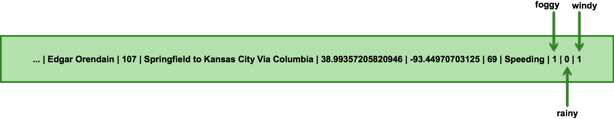

# Trucking NiFi Bundle

A NiFi bundle that includes relevant NiFi processors and controller services.

Includes a processor, GetTruckingData, that generates data mimicing sensor logs from truck sensors as well as traffic congestion data from the edge.  Underneath the hood, this processor leverages the `trucking-simulator` simulator engine included with the base project.

Upon building this module, a `nifi-trucking-nar-<version>.nar` is created, which should be uploaded to each NiFi node's `/lib` directory.  Upon a NiFi restart, all processors and controller services will be available for use.

## Outline

-   [Install](#install)
-   [GetTruckData Processor](#gettruckdata-processor)
-   [EnrichTruckData Processor](#enrichtruckdata-processor)
-   [Custom Processor Template](#custom-processor-template)

## Install

Executing `/scripts/builds/nifi-bundle.sh` will build this project and install the compiled NiFi nar to NiFi.

## GetTruckData Processor

The GetTruckData processor generates NiFi FlowFiles, using the trucking-simulator subproject under the hood.  It generates two types of data: `TruckData` and `TrafficData`, both in bar-delimited CSV.

`TruckData` looks like:
```
1488767711734|26|1|Edgar Orendain|107|Springfield to Kansas City Via Columbia|38.95940879245423|-92.21923828125|65|Speeding
```


While `TrafficData` looks like:
```
1488767711734|107|60
```


## EnrichTruckData Processor

The EnrichTruckData processor takes in FlowFiles carrying TruckData and enriches them, using the trucking-enrichment subproject under the hood.

`EnrichedTruckData` looks just like TruckData, with three fields tacked onto the end: `foggy`, `rainy`, `windy`.
```
1488767711734|26|1|Edgar Orendain|107|Springfield to Kansas City Via Columbia|38.95940879245423|-92.21923828125|65|Speeding|1|0|1
```



## Custom Processor Template
```scala
package com.orendainx.trucking.nifi.processors

import java.io.OutputStream
import java.nio.charset.StandardCharsets

import com.orendainx.hortonworks.trucking.simulator.simulators.ManualTickAndFetchSimulator
import org.apache.nifi.annotation.behavior._
import org.apache.nifi.annotation.documentation.{CapabilityDescription, Tags}
import org.apache.nifi.annotation.lifecycle.{OnRemoved, OnShutdown}
import org.apache.nifi.components.PropertyDescriptor
import org.apache.nifi.logging.ComponentLog
import org.apache.nifi.processor._
import org.apache.nifi.processor.io.OutputStreamCallback

import scala.collection.JavaConverters._

@Tags(Array("trucking", "data", "event", "generator", "simulator", "iot"))
@CapabilityDescription("Generates simulated testing data for trucking use cases")
class GetTruckingData extends AbstractProcessor {

  /** Perform necessary initialization */
  override def init(context: ProcessorInitializationContext): Unit = {
  }

  /** Called when processor is scheduled to run and when work exists for it */
  override def onTrigger(context: ProcessContext, session: ProcessSession): Unit = {

    // Creating flow file and tagging with attributes as appropriate
    var ourFlowFile = session.create()

    // Tag this data packet (i.e. flow file) with some attributes
    ourFlowFile = session.putAttribute(ourFlowFile, ...)

    // Write data to our flow file
    ourFlowFile = session.write(ourFlowFile, new OutputStreamCallback {
      override def process(outputStream: OutputStream) = outputStream.write(...)
    })

    // Send our flow file downstream
    session.transfer(ourFlowFile)

    // Acknowledge receipt and processing of our work (helps insure no data loss)
    session.commit()
  }

  @OnRemoved
  @OnShutdown
  /** Clean up and exit gracefully */
  def cleanup(): Unit = {
  }

}
```