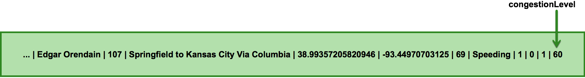

# Trucking Storm Topology

This module defines and builds Storm topologies that are deployed to Hadoop.

The config file is located at `src/main/resources/application.conf`.

## Outline

-   [Deploying](#deploying)
-   [General Flow](#general-flow)
-   [Available Topologies](#available-topologies)
    -   [NiFi To NiFi](#nifi-to-nifi)
    -   [NiFi To NiFi With Schema](#nifi-to-nifi-with-schema)
    -   [Kafka To Kafka](#kafka-to-kafka)
    -   [Kafka To Kafka With Schema](#kafka-to-kafka-with-schema)
-   [Transmitted Data](#transmitted-data)
    -   [EnrichedTruckAndTrafficData](#enrichedtruckandtrafficdata)
    -   [WindowedDriverStats](#windoweddriverstats)

## Deploying

The script `/scripts/builds/storm-topology.sh` will build and deploy one of the available topologies.  Edit that script to specify which.  Additionally, you'll want to also specify the NiFi flow to use by editing and running `/scripts/import-nifi-flow.sh`.

## General Flow

While each Storm topology available in this project is different, they all serve the same purpose:

1.  Ingest `EnrichedTruckData` and `TrafficData` events, as two different streams of data.
2.  Deserialize the data (only if coming into the flow in a serialized form).
3.  Join together instances of `EnrichedTruckData` with the most appropriate instance of `TrafficData`.  Together they are transformed into an instance of `EnrichedTruckAndTrafficData`.
4.  Process batches of joined data.  It's windowed, analyzed, and reduced into an instance of `WindowedDriverStats`.
5.  Serialize the data (only if needing to transmit in a serialized form).
6.  Data is transmitted out of Storm as two streams: one of joined `EnrichedTruckAndTrafficData` and the other of `WindowedDriverStats`.

## Available Topologies

There are four topologies available by default.

### NiFi To NiFi

-   Ingests from two different NiFi ports
-   Transmits back into NiFi via two other NiFi ports

### NiFi To NiFi With Schema

-   Ingests from two different NiFi ports.  The data ingested is expected to be serialized.
-   Deserializes the ingested data by leveraging Schema Registry.
-   Serializes the data after processing, right before it gets transmitted out of Storm.
-   Transmits back into NiFi via two other NiFi ports.  The outbound data is in a serialized form.

### Kafka To Kafka

-   Ingests from two different Kafka topics
-   Transmits back to two different Kafka topics

### Kafka To Kafka With Schema

-   Ingests from two different Kafka topics.  The data ingested is expected to be serialized.
-   Deserializes the ingested data by leveraging Schema Registry.
-   Serializes the data after processing, right before it gets transmitted out of Storm.
-   Transmits back to two different Kafka topics.  The outbound data is in a serialized form.

## Transmitted Data

Two types of data are transmitted.  Keep in mind that topologies that integrate with Schema Registry will have serialized this data before transmission, while others transmit in CSV format as showen below.

### EnrichedTruckAndTrafficData

`EnrichedTruckAndTrafficData` looks like `EnrichedTruckData` but with the `congestionLevel` field from `TrafficData` tacked onto the end.

```
1488767711734|26|1|Edgar Orendain|107|Springfield to Kansas City Via Columbia|38.95940879245423|-92.21923828125|65|Speeding|1|0|1|60
```



### WindowedDriverStats

`WindowedDriverStats` is the reduced result of a batch of data after being processed and analyzed by Storm.

```
1|67|3|2|3|2
```


