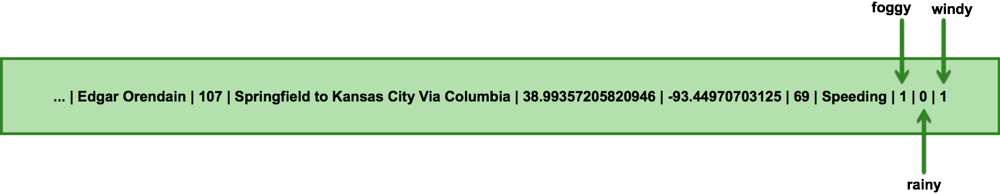

# Trucking NiFi Bundle

A NiFi bundle that includes relevant NiFi processors and controller services.

Includes a processor, GetTruckingData, that generates data mimicing sensor logs from truck sensors as well as
traffic congestion data from the edge.  Underneath the hood, this processor leverages the `trucking-simulator`
simulator engine included with the base project.

Upon building this module, a `nifi-trucking-nar-<version>.nar` is created, which should be uploaded to each
NiFi node's `/lib` directory.  Upon a NiFi restart, all processors and controller services will be available for use.

## Install

## GetTruckData
## EnrichTruckData

`EnrichedTruckData` looks just like TruckData, with three fields tacked onto the end: `foggy`, `rainy`, `windy`.
```
1488767711734|26|1|Edgar Orendain|107|Springfield to Kansas City Via Columbia|38.95940879245423|-92.21923828125|65|Speeding|1|0|1
```

