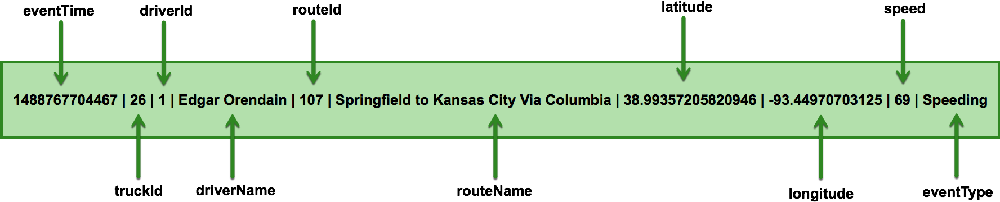

# Trucking Simulator

This is a robust, extensible simulator engine that generates trucking-related data for the larger Trucking IoT project.

## Outline

-   [Features](#features)
-   [Generating Data](#generating-data)
-   [Data Format](#data-format)
-   [For Developers](#for-developers)

## Features

-   The simulator can be used as a library or as a standlone application.
-   Different ways to store/transmit the generated data (to Kafka topics, the filesystem, Akka actors, standard out, a buffering queue for manual extraction).
-   Can run indefinitely or for a specified number of events.
-   Control of simulator parameters done through a single configuration file (`src/main/resources/application.conf`).
-   Complies with the data models defined by the `trucking-commons` project, providing custom and third party applications an interface for serializing/deserializing the generated data.

## Generating Data

If using NiFi: A custom NiFi processor has been developed that wraps this simulator and generates data entirely using NiFi's drag-and-drop interface.  **No code or terminal required**.  Check out the `trucking-nifi-bundle` project.

```
TODO: Describe how to run the simulator without NiFi (super easy, just need to get around to writing the docs.)

For now: if you have any questions, feel free to ping me.
```

## Data Format

By default, the built-in simulators generate data in vertical bar-delimited CSV.

`TruckData` looks like:
```
1488767711734|26|1|Edgar Orendain|107|Springfield to Kansas City Via Columbia|38.95940879245423|-92.21923828125|65|Speeding
```


While `TrafficData` looks like:
```
1488767711734|107|60
```


## For Developers

This simulator was developed in such a way to encourage extensibility and the addition of different components.

```
TODO: Describe how to extend the simulator.

For now: if you have any questions, feel free to ping me.
```
